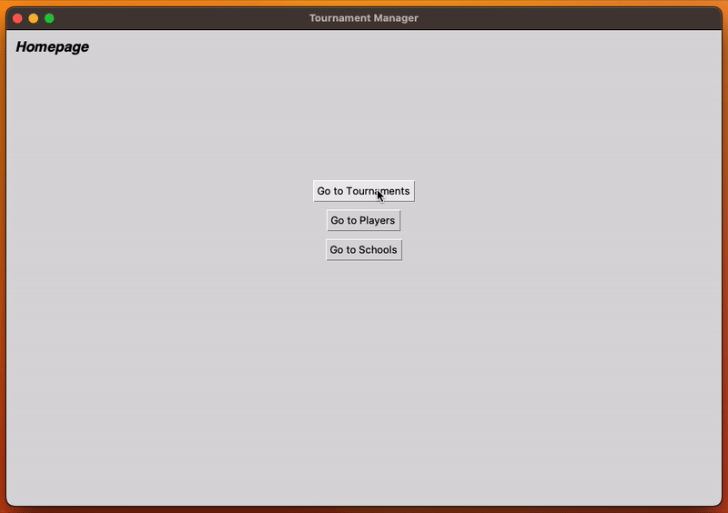

# Tournament Manager

[Roundnet](https://en.wikipedia.org/wiki/Roundnet) is a game played between two teams of two players. Roundnet
tournaments are run with one to many divisions (skill levels). A division has many teams sign up for it. A team can only
sign up for one division. A division has many matches amongst teams within a division. Each match consists of one to
many games where the team that wins the majority of the games wins the match.

Tournament Manager is a native Python application leveraging Python's Tk GUI toolkit
([Tkinter](https://docs.python.org/3/library/tkinter.html)) and using MySQL interface
([PyMySQL](https://pypi.org/project/PyMySQL/)) to communicate with the designed SQL storage database. The app allows
users to create/update/delete tournaments, tournament divisions, division teams, division matches, and game scores
within a match.

After logging into the database through the app you are presented with the homepage. The homepage has links to the 3 main sections of the app: Tournaments, Players, and Schools. Their contents are shown below.

## Requirements

### Python >= 3.11

Most systems will have Python installed, to verify your version run `python3 --version` in your command line. If your version is lower than 3.11 or the command does not return a version number, visit the Python [downloads page](https://www.python.org/downloads/) and download the latest version.

Alternatively you can use a python environment manager such as [pyenv](https://github.com/pyenv/pyenv) to install and manage your python versions. This is the recommended method as it allows you to easily switch between python versions depending on the project. If using pyenv follow the [tkinter specific instructions](https://github.com/python-poetry/poetry/issues/4322) to ensure tkinter is installed.

### Poetry

Poetry is a python package manager and virtual environment manager. It is used to install the required dependencies and manage the project's virtual environment. To install poetry visit the [Poetry installation page](https://python-poetry.org/docs/#installation) and follow the instructions for your operating system.

## Installation

Clone the repository using your preferred cloning method or download the ZIP.

Navigate to the `front_end` directory and run `poetry install` in your command line. This will install all the required dependencies and create a virtual environment for the project. To activate the virtual environment run `poetry shell` in your command line.

## Setup

### Backend
Utilize the included database dump `/back_end/dump.sql` to setup the MySQL database using your preferred database
management tool.

### Frontend
Adjust `host` and `db_name` in `front_end/main.py` based on the results of the previous section. 

## Usage

Navigate to the `front_end` directory and run `python3 main.py` in your command line.

## Project Status

The project is fully functional and meets all the set goals. As this was my first time creating a python application,
using Tkinter, and working with a SQL storage database there is significant room for improvement. However, as this was
for a course project and there exists competing solutions I am unlikely to continue work on the project. This project
was a fantastic learning experience and I hope to bring my newfound knowledge to future endeavours.